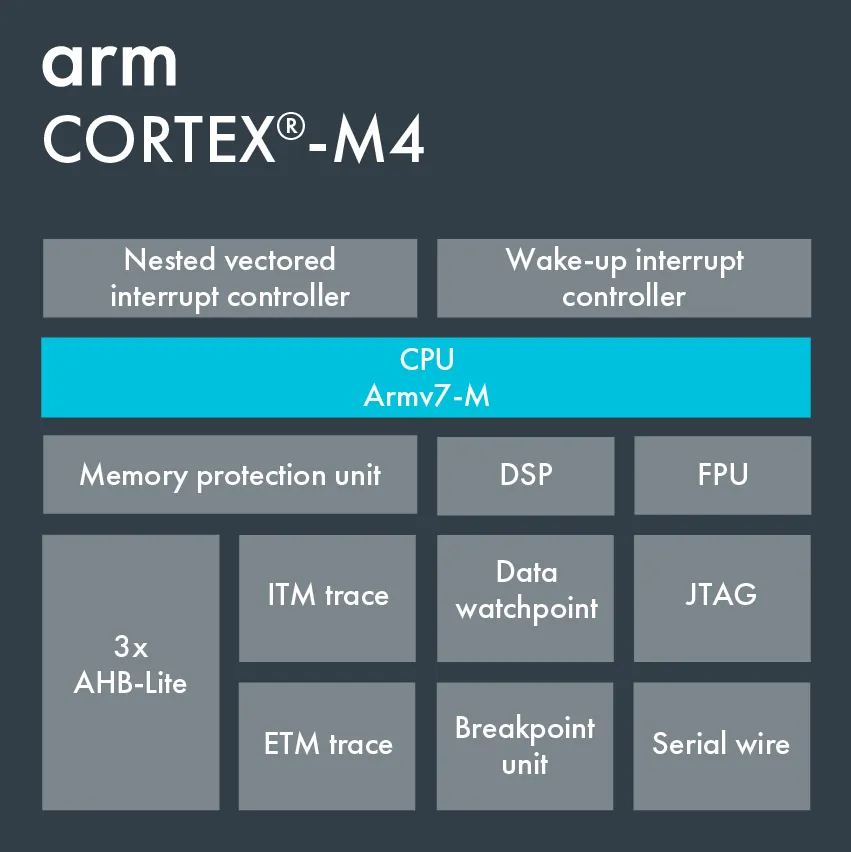

# EMNIST Letters 추론 최적화 Cortex-m4 (Arduino Nano 33 BLE)

## 런타임별 추론 시간 비교

> 측정 환경: Arduino Nano 33 BLE (nRF52840, Cortex-M4F 64 MHz)

| 모델 | 런타임 | 정밀도 | 추론 시간 |
|:----:|:------:|:------:|----------:|
| m1 | Arduino TFLite | float32 | 427.5 ms |
| m1 | Arduino TFLite (CMSIS-NN) | int8 | 133.7 ms |
| m1 | TVM AOT | float32 | 278.8 ms |
| m1 | TVM AOT | int8 | 341.0 ms |
| **m2** | **Arduino TFLite (CMSIS-NN)** | **int8** | **12.0 ms** |
| **m2** | **TVM AOT + CMSIS-NN** | **int8** | **6.6 ms** |

  

  
<table>
<tr>
  <td align="left">
    
  </td>
  <td align="left" valign="left">
    <b>왜 TVM 사용시 float32 모델이 int8 모델보다 빠른가?</b>  
    Cortex-m4는 부동소수점 연산의 처리를 돕는 FPU가 존재함. TFLite 런타임을 사용시 CMSIS-NN이 적용되어 in8 모델의 연산이 최적화되지만 TVM은 따로 처리하지 않으면 CMSIS-NN 연산 사용이 불가함. 또한 int 연산은 FPU를 사용하지 못하기 때문에 오히려 float32 모델보다 더 느린 추론 시간을 보임. 그럼에도 불구하고 TVM의 최적화 덕분에 float32 모델을 사용한 TFLite 보다 빠른 추론 시간을 보임.
  </td>
</tr>
</table>

---

## 모델 아키텍처

<table>
<tr>
  <th align="center">m1 ( Base 모델 )</th>
  <th align="center">m2 ( 경량 모델 )</th>
</tr>
<tr>
  <td align="center" valign="top">
     
  </td>
  <td align="center" valign="top">
     
  </td>
</tr>
</table>

---
정확도는 93% --> 88%로 약 5% 감소하였지만 m2_int는 양자화 및 모델 경량화를 통해 기존(m1_float)대비 **98.45%** 감소된 속도를 통해 추론을 수행할 수 있었다.
